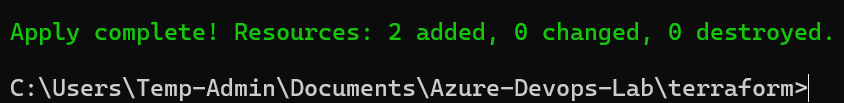
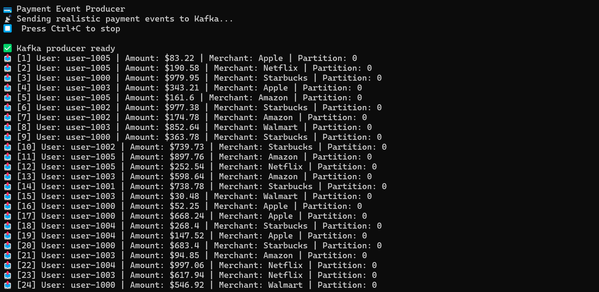
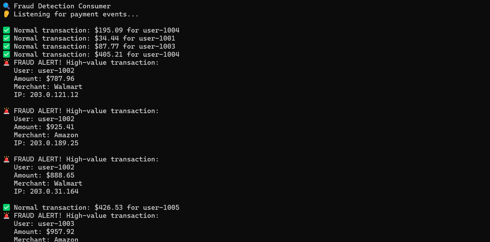

# Azure Event-Driven Architecture Lab

A production-grade event streaming platform built on **Microsoft Azure** demonstrating **real-time payment processing with fraud detection**.

## 🎯 Why I Built This
With 9 years in Azure support, I've seen how fragile manual systems can be. This lab demonstrates my transition from **reacting to outages** to **engineering resilient, automated platforms** using modern DevOps practices.

## 🛠️ Technologies Implemented
| Category | Technologies |
|----------|-------------|
| **Cloud Infrastructure** | Azure, Terraform, AKS |
| **Event Streaming** | Apache Kafka (Strimzi), Kafka Producer/Consumer |
| **Applications** | Python (Payment Producer, Fraud Detection Consumer) |
| **Observability** | kubectl, Kafka CLI tools |
| **Security & Networking** | Internal/External Kafka listeners, TLS-ready design |

## 🚀 End-to-End Workflow
1. **Infrastructure**: Terraform provisions AKS cluster with B2s VMs (free tier eligible)
2. **Kafka**: Strimzi operator deploys Kafka with external listeners for local development
3. **Payment Producer**: Sends realistic payment events to `user-payments` topic
4. **Fraud Detection**: Real-time consumer flags high-value transactions
5. **Validation**: Verified with Kafka console consumer and Azure Portal

## 🧠 Key Challenges & Solutions

### Kafka External Access
**Problem**: Kafka advertised internal Kubernetes DNS names, making external access impossible from local machines.  
**Solution**: Configured Strimzi with external listeners and `advertisedHost: localhost` for local development.

### Python 3.13 Compatibility  
**Problem**: `kafka-python` library incompatible with Python 3.13 due to deprecated `six` dependency.  
**Solution**: Implemented collections compatibility patch and used minimal, robust producer/consumer code.

### Resource Cleanup & Cost Management  
**Problem**: Avoiding Azure costs on free trial/Dev/Test subscriptions.  
**Solution**: Used B2s VMs (free tier eligible), ran resources only as long as needed for validation, and immediately destroyed everything after capturing proof.

## 🖼️ Deployment Proof

### Azure Infrastructure
| Resource Group | AKS Nodes |
|----------------|-----------|
|  |  |

### Kafka Deployment
| Strimzi CRDs | Kafka Pods | Kafka Custom Resource |
|--------------|------------|----------------------|
|  |  |  |

### Azure Portal
| Main Resource Group | Node Resource Group |
|---------------------|---------------------|
|  |  |

### Payment Processing Pipeline
| Payment Producer | Fraud Detection | Raw Kafka Messages |
|------------------|-----------------|-------------------|
|  |  |  |

## 📂 Project Structure
azure-kafka-devops-lab/
├── terraform/ # Infrastructure as Code
├── apps/
│ ├── payment-producer/ # Python producer sending payment events
│ └── fraud-consumer/ # Python consumer with fraud detection logic
├── screenshots/ # Visual proof of working deployment
└── README.md # This documentation


## ▶️ How to Reproduce

### Prerequisites
- Azure subscription (Free Trial or Dev/Test)
- Azure CLI (`az login`)
- kubectl
- Python 3.7+
- Terraform

### Steps
```bash
# 1. Deploy Azure infrastructure
terraform apply -target=azurerm_resource_group.main -target=azurerm_kubernetes_cluster.main

# 2. Configure kubectl
az aks get-credentials --name lab-aks --resource-group kafka-devops-rg

# 3. Deploy Kafka with external listeners
terraform apply

# 4. Port-forward for local access
kubectl port-forward -n kafka svc/my-cluster-kafka-external-bootstrap 9094:9094

# 5. Install dependencies
pip install -r apps/payment-producer/requirements.txt
pip install -r apps/fraud-consumer/requirements.txt

# 6. Run producer/consumer
python apps/payment-producer/payment_producer.py
python apps/fraud-consumer/fraud_consumer.py